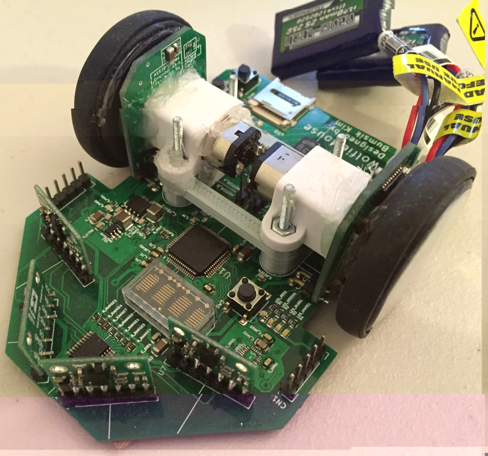

# WolfieMouse

* Trello: <https://trello.com/b/nIOMXuWJ>

This is project for IEEE Region 1 Micromouse competition.

## Get started

### Quick setup using a virtual machine (recommended)

1. Install tools
    * [git](https://git-scm.com/downloads)
    * [VirtualBox](https://www.virtualbox.org/wiki/Downloads) and [VirtualBox Extension Pack(https://www.virtualbox.org/wiki/Downloads)
    * [Vagrant](https://www.vagrantup.com/)
    * [MobaXterm](http://mobaxterm.mobatek.net/) for windows, [XQuartz](https://www.xquartz.org/) for macOS
    * Add to `PATH` with following folders:
        * git: `{your-git-installation-path}/Git/bin` and `{your-git-installation-path}/Git/usr/bin`
        * VirtualBox: `{your-VirtualBox-installation-path}/Oracle/VirtualBox`
2. [Fork this repo and clone it](doc/Github_HOWTO.md#Set-up-your-repository)
3. Run `$ vagrant up`
    * This is a virtual machine installation command. Requires around 8GB.
    * This will take at least 20 minutes. Have a cup of coffee :)
4. After successful install, [connect to the machine using SSH](doc/SSH_HOWTO.md)
5. `$ cd ~/WolfieMouse`
6. `$ make eclipse`

### Regular setup without virtual machine (when virtual machine not working properly)

To be added.

## Get started

### Quick setup using a virtual machine (recommended)

1. Install tools
    * [git](https://git-scm.com/downloads)
    * [VirtualBox](https://www.virtualbox.org/wiki/Downloads) and [VirtualBox Extension Pack(https://www.virtualbox.org/wiki/Downloads)
    * [Vagrant](https://www.vagrantup.com/)
    * [MobaXterm](http://mobaxterm.mobatek.net/) for windows, [XQuartz](https://www.xquartz.org/) for macOS
    * Add to `PATH` with following folders:
        * git: `{your-git-installation-path}/Git/bin` and `{your-git-installation-path}/Git/usr/bin`
        * VirtualBox: `{your-VirtualBox-installation-path}/Oracle/VirtualBox`
2. [Fork this repo and clone it](doc/Github_HOWTO.md#Set-up-your-repository)
3. Run `$ vagrant up`
    * This is a virtual machine installation command. Requires around 8GB.
    * This will take at least 20 minutes. Have a cup of coffee :)
4. After successful install, [connect to the machine using SSH](doc/SSH_HOWTO.md)
5. `$ cd ~/WolfieMouse`
6. `$ make eclipse`

### Regular setup without virtual machine (when virtual machine not working properly)

To be added.

## Directory descriptions

* `doc`: Documentation folder
* `projects`: Projects folders, including main and test projects
* `simulation`: another project folder but for algorithm simulation
* `settings`: Setting files like include path and symbol. Also there is base CubeMX project is located.
* `source`: Source codes of common libraries

